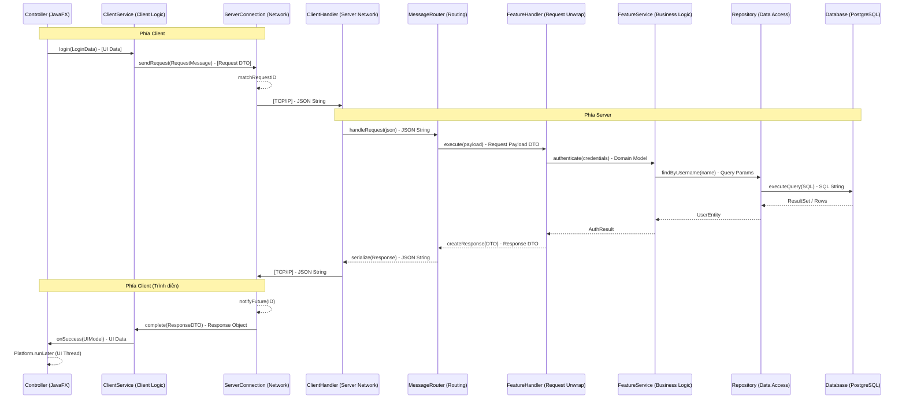

# Luồng Giao tiếp Client-Server

Tài liệu này mô tả luồng kiến trúc tiêu chuẩn cho việc giao tiếp giữa Client và Server trong Hệ thống Đấu giá. Nội dung bao gồm các tầng (layer), class và method tham gia vào một chu trình request-response điển hình.

## Tổng quan

Hệ thống sử dụng mô hình **Synchronous-over-Asynchronous** (Đồng bộ trên nền Bất đồng bộ). Mặc dù giao tiếp mạng là bất đồng bộ (sử dụng non-blocking socket và `CompletableFuture`), các service tầng cao cung cấp một API dạng promise tinh gọn cho các UI controller.

---

## 1. Luồng Gửi Yêu cầu (Client đến Server)

Khi người dùng thực hiện một hành động (ví dụ: nhấn nút "Login"), luồng xử lý diễn ra như sau:
x
### A. Tầng UI

- **Thành phần**: `View.fxml` & `Controller` (ví dụ: `LoginController`)
- **Hành động**: Người dùng nhấn nút, kích hoạt một method `@FXML`.
- **Method**: `handleLogin()` gọi `authClientService.login(email, password)`.

### B. Tầng Client Service

- **Thành phần**: `AuthClientService` (kế thừa `BaseClientService`)
- **Hành động**: Kiểm tra dữ liệu đầu vào (validate) tại chỗ, sau đó đóng gói dữ liệu vào một `RequestMessage`.
- **Method**: 
    1. Tạo `new RequestMessage<>(MessageType.LOGIN, new LoginRequest(...))`.
    2. Gọi `this.send(request, AuthResponse.class)`.
    
> **Lưu ý về "Bản thiết kế" (Blueprint)**: Việc truyền `AuthResponse.class` ở đây là cực kỳ quan trọng do cơ chế **Type Erasure** của Java. Vì Java xóa bỏ thông tin kiểu dữ liệu generic sau khi biên dịch, chúng ta cần gửi kèm "bản thiết kế" này để Client có thể nhớ và dùng nó để giải mã dữ liệu khi phản hồi quay trở về sau này.

### C. Tầng Infrastructure (Client)

- **Thành phần**: `BaseClientService` & `ServerConnection`
- **Hành động**: Quản lý socket và theo dõi các yêu cầu đang chờ xử lý qua một "Sổ đăng ký".
- **Method**:
    1. `BaseClientService.send()`: Gọi `ServerConnection.sendRequest()`.
    2. `ServerConnection.sendRequest()`: 
        - Gán một `requestId` duy nhất (UUID).
        - **Ghi vào Sổ đăng ký**: Lưu trữ một `PendingRequest` (chứa cả `CompletableFuture` và "Bản thiết kế" `.class` ở trên) vào `ConcurrentHashMap` gọi là `pendingRequests`. 
        - *Lưu ý*: Đây không phải hàng đợi để gửi, mà là nơi lưu giữ thông tin để "khớp" với phản hồi sau này.
        - Serialize message sang định dạng JSON thông qua `JsonUtil.toJson()`.
        - Ghi chuỗi JSON vào output stream của `Socket`.

---

## 2. Luồng Xử lý (Phía Server)

Server luôn lắng nghe dữ liệu đến thông qua một luồng (thread) riêng biệt cho mỗi client.

### A. Tầng Network

- **Thành phần**: `ClientHandler` (Runnable)
- **Hành động**: Đọc các chuỗi JSON thô từ socket.
- **Method**: Vòng lặp `run()` gọi `in.readLine()`, sau đó chuyển chuỗi nhận được cho `MessageRouter.handleRequest(json)`.

### B. Tầng Routing

- **Thành phần**: `MessageRouter`
- **Hành động**: Điều hướng yêu cầu đến đúng module tính năng.
- **Method**: `handleRequest(json)` thực hiện:
    1. Phân tích "Envelope" (trích xuất `type` và `requestId`).
    2. Tìm kiếm `MessageRouteAction` đã đăng ký tương ứng với `MessageType`.
    3. Gọi `action.execute(requestId, payloadJson)`.

### C. Tầng Feature (Handler/Service/Repo)

- **Thành phần**: `AuthHandler`, `AuthService`, `UserRepository`
- **Hành động**: Thực thi logic nghiệp vụ.
- **Method**:
    1. `AuthHandler.execute()`: Deserialize payload thành DTO (ví dụ: `LoginRequest`), gọi `authService.authenticate(...)`.
    2. `AuthService`: Thực hiện logic (ví dụ: kiểm tra băm mật khẩu).
    3. `UserRepository`: Truy vấn cơ sở dữ liệu sử dụng SQL qua `DBConnection`.
    4. **Kết quả**: Handler trả về một `ResponseMessage<AuthResponse>`.

---

## 3. Luồng Phản hồi (Server về Client)

Sau khi xử lý hoàn tất, kết quả được gửi trả lại cho người dùng.

### A. Truyền dữ liệu từ Server

- **Thành phần**: `MessageRouter` & `ClientHandler`
- **Hành động**: Serialize phản hồi và gửi đi.
- **Method**: 
    1. `MessageRouter` chuyển đổi `ResponseMessage` thành chuỗi JSON.
    2. `ClientHandler.push(json)` ghi chuỗi JSON vào socket.

### B. Tiếp nhận dữ liệu tại Client

- **Thành phần**: `ServerConnection` (Listener Thread)
- **Hành động**: Lắng nghe phản hồi và khớp với các yêu cầu đang chờ trong "Sổ đăng ký".
- **Method**:
    1. Vòng lặp `startListening()` đọc JSON phản hồi.
    2. `handleRawResponse(json)` thực hiện:
        - Trích xuất `requestId` từ JSON.
        - **Tra cứu Sổ đăng ký**: Lấy và xóa `PendingRequest` ra khỏi map `pendingRequests` dựa trên ID.
        - **Giải mã với Bản thiết kế**: Dùng `pending.responseClass` (bản thiết kế đã lưu lúc gửi) để hướng dẫn Jackson cách deserialize JSON thành đúng Object DTO (ví dụ: `AuthResponse`).
        - **Hoàn tất Lời hứa**: Gọi `future.complete(response)`, lúc này dữ liệu chính thức được đổ vào `CompletableFuture`.

### C. Hoàn tất và Cập nhật UI

- **Thành phần**: `BaseClientService` & `Controller`
- **Hành động**: Giải nén kết quả và cập nhật màn hình.
- **Method**:
    1. `BaseClientService.unwrap()`: Kiểm tra `response.isSuccess()`. Nếu thất bại, ném ra `AuctionException`.
    2. `Controller`: Nhận kết quả trong khối `.thenAccept()` hoặc `.handle()`.
    3. **QUAN TRỌNG**: Sử dụng `Platform.runLater(() -> ...)` để đảm bảo việc cập nhật UI diễn ra trên JavaFX Application Thread vì lúc này chúng ta vẫn đang ở luồng chạy ngầm của Listener.

---

## Biểu đồ Tổng quát (Logic Flow)

---

## 4. Mô hình Đa luồng (Concurrency)

Việc hiểu rõ luồng nào đang thực thi tại mỗi thời điểm là rất quan trọng để tránh tình trạng treo UI và các lỗi "Illegal State" trong JavaFX.

### Quy trình Thực thi

1. **JavaFX Application Thread (UI Thread)**:
    - Thực thi trong `Controller`.
    - Gọi method của `ClientService`.
    - Khởi tạo kết nối mạng nhưng **không chờ đợi (không block)**. Luồng này quay lại ngay lập tức để giữ cho UI phản hồi mượt mà.
2. **Server Worker Thread (`ClientHandler`)**:
    - Tại server, một luồng từ `FixedThreadPool` tiếp nhận yêu cầu.
    - Thực hiện truy vấn DB và logic nghiệp vụ.
    - Ghi phản hồi ngược lại socket.
3. **Client Listener Thread (Background/Daemon)**:
    - Bên trong `ServerConnection`, một luồng chạy ngầm (`listenerThread`) liên tục thực hiện vòng lặp `while` trên `in.readLine()`.
    - Khi có phản hồi đến, **luồng chạy ngầm này** sẽ thức dậy.
    - Nó gọi `future.complete(response)`.
4. **Thực thi Callback**:
    - Mã nguồn bên trong `.thenAccept()` hoặc `.handle()` tại Controller được thực thi bởi **Client Listener Thread** (vì đây là luồng đã hoàn tất future).
    - **QUAN TRỌNG**: Vì đây là luồng chạy ngầm, nó **không thể** cập nhật trực tiếp các thành phần UI (label, button, list).
5. **Chuyển đổi Luồng (`Platform.runLater`)**:
    - Luồng chạy ngầm gọi `Platform.runLater(() -> { ... })`.
    - Thao tác này đưa một tác vụ (task) vào hàng đợi của UI Thread.
    - UI Thread sau đó sẽ lấy tác vụ này và thực hiện cập nhật màn hình.

---

## 5. Tài liệu Liên quan

- **Real-time Push Notifications**: Xem chi tiết về luồng cập nhật một chiều từ server đến client (thông báo đấu giá, alert) tại [realtime-push.md](../modules/realtime-push-quang.md).
- **Xử lý Ngoại lệ (Exception Handling)**: Xem chi tiết về cách lỗi được lan truyền và xử lý tại [exception-handling.md](./exception-handling.md).

## Danh sách các Class Chính

| Tầng | Class | Mục đích |
| :--- | :--- | :--- |
| **Common** | `RequestMessage<T>` | Cấu trúc bao gói tiêu chuẩn cho mọi yêu cầu từ client đến server. |
| **Common** | `ResponseMessage<T>` | Cấu trúc bao gói tiêu chuẩn cho mọi phản hồi từ server đến client. |
| **Client** | `ServerConnection` | Singleton quản lý socket và map lưu trữ các yêu cầu bất đồng bộ. |
| **Client** | `BaseClientService` | Class cơ sở cung cấp cơ chế xử lý lỗi và giải nén phản hồi. |
| **Server** | `ClientHandler` | Worker xử lý việc đọc/ghi dữ liệu trên từng socket của client. |
| **Server** | `MessageRouter` | Trung tâm điều hướng message dựa trên `MessageType`. |
| **Server** | `MessageRouteAction` | Interface được các feature handler thực thi để xử lý yêu cầu. |
