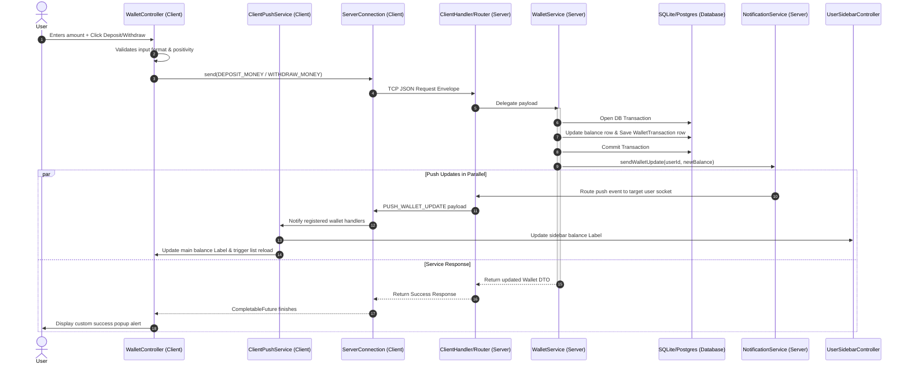
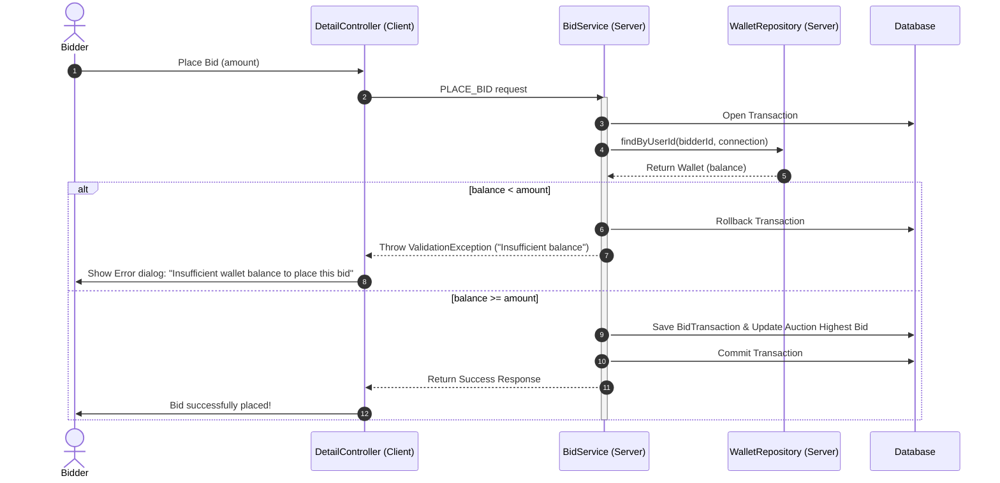
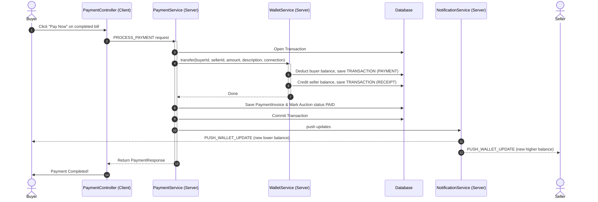

# Wallet System Architecture & Flow

This document details the architectural design, features, and workflows of the real-time Mock Wallet System integrated into the Auction System.

---

## 1. Overview
The **Mock Wallet System** provides a virtual balance of **$100,000.00** to every user, allowing them to participate in bidding and finalize checkouts. It protects the integrity of auctions by validating that users have sufficient funds before placing bids, and automates balance transfers between buyers and sellers upon payment checkouts.

---

## 2. Key Features

1. **Automatic Balance Seeding ($100,000.00)**:
   - Every existing user is seeded with `$100,000.00` on server startup.
   - New users default to `$100,000.00` upon registration.
2. **Bidding Fund Protection**:
   - Validates user balances before a bid is committed to the database. Insufficient balance returns a validation error.
3. **Automated Checkout Escrow**:
   - During payment checkout, the system deducts the winning bid amount from the buyer and adds it to the seller's wallet in a single database transaction.
4. **Real-time Balance Synchronization**:
   - Balance changes from any action (deposit, withdraw, checkout) are instantly pushed to the user's active client socket, updating both the sidebar and the wallet page without page reloads.
5. **Interactive Actions & Logs UI**:
   - Quick-deposit and quick-withdrawal shortcuts (e.g. `+$1k`, `-$500`).
   - Detailed logs with color-coded directional amounts (green for credit, red for debit) and status badges.

---

## 3. Database Schema

The database relies on two tables: `wallets` and `wallet_transactions`.

```sql
-- Represents a user's wallet
CREATE TABLE IF NOT EXISTS wallets (
    user_id UUID PRIMARY KEY REFERENCES users(id) ON DELETE CASCADE,
    balance DECIMAL(15, 2) NOT NULL DEFAULT 100000.00 CHECK (balance >= 0)
);

-- Records transaction log entries
CREATE TABLE IF NOT EXISTS wallet_transactions (
    id UUID PRIMARY KEY,
    user_id UUID NOT NULL REFERENCES users(id) ON DELETE CASCADE,
    amount DECIMAL(15, 2) NOT NULL CHECK (amount > 0),
    transaction_type VARCHAR(20) NOT NULL, -- DEPOSIT, WITHDRAW, PAYMENT, RECEIPT, REFUND
    reference_id VARCHAR(50),
    description VARCHAR(255),
    created_at TIMESTAMP NOT NULL DEFAULT CURRENT_TIMESTAMP
);

CREATE INDEX IF NOT EXISTS idx_wallet_tx_user ON wallet_transactions(user_id);
```

---

## 4. Components Map

### Backend (Server)
- **Entity**: [Wallet.java](file:///c:/Users/ACER/BTL_Nhom1_AuctionSystem/src/main/java/com/nhom1/auction/common/entity/Wallet.java) & [WalletTransaction.java](file:///c:/Users/ACER/BTL_Nhom1_AuctionSystem/src/main/java/com/nhom1/auction/common/entity/WalletTransaction.java)
- **Repository**: [WalletRepository.java](file:///c:/Users/ACER/BTL_Nhom1_AuctionSystem/src/main/java/com/nhom1/auction/server/wallet/WalletRepository.java)
- **Service**: [WalletService.java](file:///c:/Users/ACER/BTL_Nhom1_AuctionSystem/src/main/java/com/nhom1/auction/server/wallet/WalletService.java)
- **Routing Module & Handler**: [WalletModule.java](file:///c:/Users/ACER/BTL_Nhom1_AuctionSystem/src/main/java/com/nhom1/auction/server/wallet/WalletModule.java) & [WalletHandler.java](file:///c:/Users/ACER/BTL_Nhom1_AuctionSystem/src/main/java/com/nhom1/auction/server/wallet/WalletHandler.java)
- **Startup Migrator**: [DatabaseInitializer.java](file:///c:/Users/ACER/BTL_Nhom1_AuctionSystem/src/main/java/com/nhom1/auction/server/infrastructure/database/DatabaseInitializer.java)

### Integration Interfaces
- **Bidding Verification**: [BidService.java](file:///c:/Users/ACER/BTL_Nhom1_AuctionSystem/src/main/java/com/nhom1/auction/server/bidding/BidService.java)
- **Checkout Transfer**: [PaymentService.java](file:///c:/Users/ACER/BTL_Nhom1_AuctionSystem/src/main/java/com/nhom1/auction/server/payment/PaymentService.java)
- **Connection Linking**: [ClientHandler.java](file:///c:/Users/ACER/BTL_Nhom1_AuctionSystem/src/main/java/com/nhom1/auction/server/infrastructure/ClientHandler.java)
- **Push Notification Service**: [NotificationService.java](file:///c:/Users/ACER/BTL_Nhom1_AuctionSystem/src/main/java/com/nhom1/auction/server/infrastructure/NotificationService.java)

### Client (GUI)
- **Service**: [WalletClientService.java](file:///c:/Users/ACER/BTL_Nhom1_AuctionSystem/src/main/java/com/nhom1/auction/client/user/service/WalletClientService.java)
- **Client Push Manager**: [ClientPushService.java](file:///c:/Users/ACER/BTL_Nhom1_AuctionSystem/src/main/java/com/nhom1/auction/client/service/ClientPushService.java)
- **Navigation Router**: [AppView.java](file:///c:/Users/ACER/BTL_Nhom1_AuctionSystem/src/main/java/com/nhom1/auction/client/AppView.java)
- **Sidebar Integration**: [UserSidebarController.java](file:///c:/Users/ACER/BTL_Nhom1_AuctionSystem/src/main/java/com/nhom1/auction/client/user/controller/UserSidebarController.java) & [user_sidebar.fxml](file:///c:/Users/ACER/BTL_Nhom1_AuctionSystem/src/main/resources/views/user/components/user_sidebar.fxml)
- **Wallet View Components**: [WalletController.java](file:///c:/Users/ACER/BTL_Nhom1_AuctionSystem/src/main/java/com/nhom1/auction/client/user/controller/WalletController.java), [wallet.fxml](file:///c:/Users/ACER/BTL_Nhom1_AuctionSystem/src/main/resources/views/user/wallet.fxml), & [wallet.css](file:///c:/Users/ACER/BTL_Nhom1_AuctionSystem/src/main/resources/css/client/wallet.css)

---

## 5. Detailed Workflows

### A. Deposit & Withdrawal Flow (With Real-Time Sync)



---

### B. Bidding Balance Verification Flow



---

### C. Checkout Payment Flow (Transfers)



---

## 6. API Protocol DTOs

Communications pass over socket JSON envelopes using `RequestMessage<T>` and `ResponseMessage<T>`.

### Request DTOs
1. **`GET_WALLET`** ([GetWalletRequest.java](file:///c:/Users/ACER/BTL_Nhom1_AuctionSystem/src/main/java/com/nhom1/auction/common/dto/wallet/GetWalletRequest.java))
   ```json
   {
     "userId": "uuid-string"
   }
   ```
2. **`DEPOSIT_MONEY`** ([DepositRequest.java](file:///c:/Users/ACER/BTL_Nhom1_AuctionSystem/src/main/java/com/nhom1/auction/common/dto/wallet/DepositRequest.java))
   ```json
   {
     "userId": "uuid-string",
     "amount": 500.00
   }
   ```
3. **`WITHDRAW_MONEY`** ([WithdrawRequest.java](file:///c:/Users/ACER/BTL_Nhom1_AuctionSystem/src/main/java/com/nhom1/auction/common/dto/wallet/WithdrawRequest.java))
   ```json
   {
     "userId": "uuid-string",
     "amount": 200.00
   }
   ```

### Response DTOs
* **`WalletResponse`** ([WalletResponse.java](file:///c:/Users/ACER/BTL_Nhom1_AuctionSystem/src/main/java/com/nhom1/auction/common/dto/wallet/WalletResponse.java))
  ```json
  {
    "userId": "uuid-string",
    "balance": 100300.00,
    "transactions": [
      {
        "id": "transaction-uuid",
        "amount": 500.00,
        "transactionType": "DEPOSIT",
        "referenceId": null,
        "description": "Deposit via UI client",
        "createdAt": "2026-05-22T21:55:00"
      }
    ]
  }
  ```

### Push Event DTOs
* **`PUSH_WALLET_UPDATE`** ([WalletUpdateEvent.java](file:///c:/Users/ACER/BTL_Nhom1_AuctionSystem/src/main/java/com/nhom1/auction/common/dto/notification/WalletUpdateEvent.java))
  ```json
  {
    "userId": "uuid-string",
    "newBalance": 100300.00
  }
  ```
